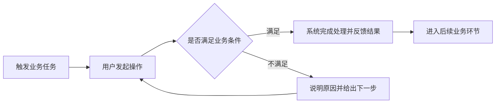
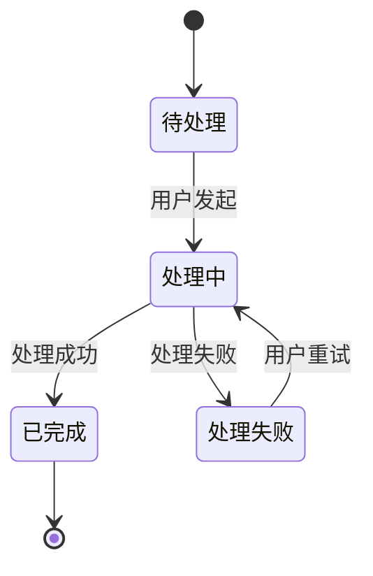

# 企业级后台产品 PRD 模板

> 适用范围：不同产品线的企业级后台产品新建、改造和增量需求。
>
> 使用方式：以下 12 章是通用骨架，用于统一团队的阅读顺序。第 2、4、6、9、12 章通常保留，其余章节按需求实际情况选择、合并或省略。一级、二级和必要的三级标题可以稳定；更细标题根据功能类型、复杂度和风险动态生成。
>
> 内容原则：详细功能设计是正文核心。文档只写会影响产品理解、研发设计、测试验证和业务确认的内容，不追求页数，不用空表格和套话撑篇幅。

## 文档信息

Word 文档设置独立封面，封面至少包括产品或项目名称、需求名称、版本、文档状态、产品负责人和日期。正文首页按需增加文档控制信息：

| 项目 | 内容 |
|---|---|
| 产品/项目名称 |  |
| 需求名称 |  |
| PRD 版本与状态 | 草稿 / 待评审 / 已确认 / 已归档 |
| 产品负责人 |  |
| 计划版本/里程碑 |  |
| 创建日期/最后更新日期 |  |
| 关联材料 | 发现简报、原型、流程图、决定记录等 |

### 变更记录

| 版本 | 日期 | 变更内容 | 变更原因 | 修改人 |
|---|---|---|---|---|

评审决定较多时增加“评审与决定记录”；小型需求可以省略。

### 编写约定

- 正文只保留当前生效口径，历史方案和讨论过程进入变更记录或决定记录。
- 会改变范围、流程、规则、状态、权限或验收口径的未知项标记为“阻断待确认”，写明影响、责任人和最晚确认点。
- 功能编号 `F-` 和验收编号 `AC-` 按文档规模选用。小型单功能 PRD 可以只使用章节编号。
- 数据库字段、字段类型长度、接口地址、请求响应参数、数据表结构、技术组件、代码逻辑和部署方式进入研发开发设计，不写入产品 PRD。
- 页面需要展示、填写或选择的内容，用业务语言说明含义、来源、条件、结果和用户反馈。

## 1. 名词与缩略语〔按需〕

仅收录会影响需求理解、规则判断或验收的业务名词、产品名词、状态名和缩略语。常用词不重复解释。

| 名词/缩略语 | 定义 | 边界或容易混淆的概念 |
|---|---|---|

## 2. 业务背景介绍

使用一至三段短文说明需求来源、目标用户、当前问题、问题依据、业务影响和本期处理原因。通常控制在 300 字以内，删除行业套话、宣传性判断和无法影响本期方案的背景。

推荐写法：

> 【目标用户】在【业务场景】中需要完成【任务】。当前产品在【具体环节】存在【已确认问题】，造成【业务影响】。本期通过【产品改造方向】解决该问题，范围限定为【本期边界】。

## 3. 产品现状分析〔存量改造时使用〕

说明当前产品怎么处理这项业务、用户在哪里受阻、本次需要保留、修改或下线哪些能力。简单需求使用两三段文字；变化点较多时使用对比表或现状流程图。

| 对象或环节 | 当前处理方式 | 明确问题 | 本期处理结论 |
|---|---|---|---|

## 4. 关键需求

### 4.1 核心业务需求

只保留决定本期价值和范围的需求，每条需求用一句可判断结果的话表达。

| 需求/功能 | 使用角色 | 要完成的业务任务 | 期望结果 | 优先级 |
|---|---|---|---|---|

### 4.2 非功能性需求〔按需〕

只写产品经理可以确认、测试可以验证，并且会影响方案或交付的要求，例如响应时间、处理规模、浏览器兼容、安全和可用性。指标尚未确认时进入待确认项。

### 4.3 亮点需求〔按需〕

只写具有明确用户价值、产品机制和验证方式的差异化能力。普通项目和内部改造可以省略。

## 5. 业务流程〔存在流程流转时使用〕

出现多角色交接、三个及以上连续步骤、条件分支、状态变化、回退或异常恢复时，优先使用流程图。流程图至少标明起点、角色、关键判断、主要分支、异常去向和终点。

图下只补充流程图难以表达的规则，例如关键前置条件、分支优先级、超时处理和回退限制。流程简单时使用三至五条步骤说明即可。

## 6. 功能清单

功能清单用于确认本期范围。功能描述控制在一句话内，详细内容进入第 9 章。

| 模块/页面 | 功能名称 | 功能说明 | 使用角色 | 本期动作 | 优先级 |
|---|---|---|---|---|---|

本期动作可以使用新增、改造、保留或下线。大型 PRD 按需增加功能编号和对应原型，小型 PRD保持简洁。

## 7. 授权场景控制点〔涉及产品授权时使用〕

本章用于描述产品许可、商业授权、版本能力、额度或期限控制。说明什么情况下可以使用、超限或过期时用户看到什么、用户下一步可以怎么做。角色权限和数据范围在具体功能中说明。

没有产品授权控制时省略本章，不生成空授权表。

## 8. 主数据清单〔涉及共享业务对象时使用〕

仅说明被多个功能、模块或系统共同使用，并且必须统一业务口径的对象，例如组织、人员、客户、供应商、项目和科目。写清业务定义、权威来源、使用范围和失效规则即可。

不展开数据库字段、同步接口、表结构和存储方式。对象较少时使用短段落，对象较多时使用简表。

## 9. 详细功能设计

本章按功能清单逐项编写。一个 `9.n` 对应一个清晰用户任务或一个完整业务目标。章节深度跟随实际需求，下面的小节用于选择，不要求逐项复制。

### 9.n 功能名称〔按需增加 F-XXX〕

#### 9.n.1 功能概述

功能概述必须使用简短文字，直接说明这个功能是干什么的。建议用一段话回答：谁在什么情况下使用、解决什么问题、完成后得到什么结果。

推荐写法：

> 【功能名称】用于帮助【使用角色】在【使用场景】下完成【核心任务】。用户通过【入口或触发方式】进入，系统根据【关键业务条件】完成【产品处理】，最终向用户提供【可观察结果或后续去向】。

不使用功能概述表格，不罗列功能目标、入口、前置条件、对象和关联项等固定字段。

#### 9.n.2 界面图形〔有页面时使用〕

插入原型、线框图或关键页面截图，标明页面名称和版本。图片用于说明页面结构、信息层级、操作位置和主要状态。

图片下用短段落或列表说明：

- 用户从哪里进入，完成后返回哪里；
- 页面主要分成哪些区域，每个区域解决什么任务；
- 页面展示哪些关键信息，用户可以执行哪些操作；
- 加载中、空数据、无权限、失败、只读或处理中等相关状态如何表现；
- 原型中无法完整表达的交互条件和反馈。

没有页面的后台任务、规则能力或系统触发功能可以省略本节。

#### 9.n.3 数据域说明〔存在关键业务信息时使用〕

从产品角度说明本功能围绕哪些业务对象和关键信息工作，以及这些信息如何影响用户操作和业务结果。必要时写清：

- 核心业务对象及其关系；
- 页面展示、用户录入或系统生成的关键信息；
- 重要业务口径、单位、范围、枚举含义或计算方式；
- 信息来自哪里、在什么时点更新、后续用于什么业务环节；
- 用户可见的历史、失效、脱敏或留痕要求。

优先使用自然语言。只有信息较多、需要对比时才使用简表。不得写数据库字段、类型长度、表结构、接口请求参数和响应参数。

#### 9.n.4 功能说明

以下细目根据实际功能选择、合并、改名或省略。页面查询类功能可以重点写页面和筛选规则，流程类功能可以重点写流转和状态，配置类功能可以重点写生效范围与规则。

##### 使用入口与前置条件〔按需〕

说明谁能使用、从哪里进入、使用前需要满足哪些业务条件，以及不满足时用户看到什么。

##### 用户操作与系统反馈〔通常保留〕

按真实使用顺序描述用户操作和系统反馈。每个关键操作至少说清：

- 在什么条件下可以执行；
- 用户执行什么动作；
- 系统进行哪些产品层面的判断和处理；
- 成功后页面如何反馈、业务结果如何变化、下一步去哪里；
- 失败时提示什么、已经完成的内容如何处理、用户如何继续。

推荐句式：

> 当【条件】时，用户执行【操作】；系统判断【业务规则】并完成【产品处理】。成功后【可观察结果】；失败时【提示与恢复方式】。

操作较少时使用连续短段落，多个操作需要横向比较时使用表格。

##### 业务规则〔存在判断逻辑时使用〕

写清触发时点、判断条件、处理结果、规则优先级、例外和边界值。一条规则表达一个确定结论。复杂条件优先使用决策表，计算类规则给出业务公式和示例。

| 业务条件 | 系统表现或业务结果 | 例外/边界 |
|---|---|---|

##### 流程与状态〔存在流转时使用〕

说明业务对象会经历哪些用户可理解的状态、由什么动作触发变化、每个状态下允许做什么，以及撤回、退回、取消、超时和失败后如何处理。

状态超过三个、存在分支或逆向路径时使用状态图或流程图：

##### 权限与数据范围〔存在角色差异时使用〕

用产品语言说明哪些角色可以查看、发起、编辑、撤回或管理，以及每个角色可以处理哪些组织、人员或业务范围。写清无权限、权限变化和跨组织访问时的页面表现。

角色差异较多时使用权限矩阵；没有差异时用一句话说明即可。

##### 异常与边界〔按真实风险选择〕

覆盖会改变用户操作或业务结果的异常，例如空数据、重复操作、数据已变化、依赖能力不可用、部分成功、处理中断、历史数据和大数据量。每个场景写清触发条件、系统表现、用户提示、业务结果和恢复方式。

不逐项套用通用异常清单，只保留与本功能有关的内容。

##### 验收要点〔通常保留〕

每条验收场景写清前置条件、用户操作和可观察结果。大型需求可以使用 `AC-XXX`，小型需求直接编号。

| 场景 | 前置条件 | 用户操作 | 预期产品结果 |
|---|---|---|---|

预期结果应落到页面内容、提示、可执行操作、业务状态或后续流程，避免使用“功能正常”“符合预期”“数据正确”。

> 后续功能按需要复制 `9.n` 的上层结构，细节标题随功能变化。

### 产品 PRD 与研发设计的边界

以下内容属于产品 PRD：用户场景、页面表现、操作条件、业务规则、产品状态、角色权限、异常反馈、业务结果和验收标准。

以下内容由研发在开发设计中完成：数据库字段和表结构、接口地址与参数、类和组件、算法与代码逻辑、缓存与消息机制、部署拓扑、技术错误码和内部监控实现。

如果某项技术约束已经确定，并且会改变用户体验或业务规则，PRD 只记录该约束带来的产品表现和验收要求。

## 10. 上下游影响〔影响现有能力时使用〕

说明本需求会影响哪些现有页面、业务流程、角色权限、报表、消息、存量数据、外部系统或客户端，以及用户会感知到什么变化。跨系统协作只定义业务触发、期望结果、失败时的产品表现和责任边界，不编写接口协议。

影响点较少时使用列表，影响对象较多时使用表格。

## 11. 实施体系配套〔上线前需要准备时使用〕

记录功能上线前必须准备的产品事项，例如菜单和角色授权、业务参数、字典、模板、预置规则、主数据初始化、历史数据处理、操作说明、培训、试点范围和业务回退方案。

研发部署步骤、组件配置和技术监控方案进入实施或开发设计文档。

## 12. 场景验证清单

汇总会决定需求能否通过评审和验收的关键场景，覆盖主流程、关键分支、重要规则、权限差异、异常恢复和高风险边界。简单需求可以直接沿用第 9 章验收要点，避免重复抄写。

| 场景编号 | 对应功能 | 场景类型 | 前置条件 | 操作步骤 | 预期产品结果 | 优先级 |
|---|---|---|---|---|---|---|

## 可选专题

AI 能力、审核审批流、数据分析、导入导出、消息通知、移动端、国际化、数据迁移、运营监控和安全合规等内容均按实际需求增加。优先放入相关功能的详细设计；跨多个功能且确实需要统一说明时，再增加独立专题章节。

## Word 交付基线

- 使用 A4 竖版，正文不使用横向页面承载过宽表格；优先精简列数或改用短段落。
- 设置正式独立封面；封面不显示正文页眉和页码。
- 正文页眉使用纯白背景、简洁文字和细分隔线，不使用大面积色块。
- 正文以短段落、列表、流程图和必要表格组合表达，避免整篇由表格组成。
- 表格只承载适合横向比较的内容，表头使用克制的浅色样式。
- 交付前检查目录、章节顺序、跨页表格、图片清晰度、页眉页脚、页码和逐页渲染效果。
